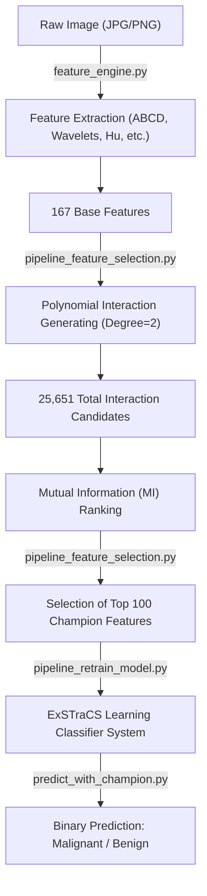

## 1. Overview
The **Derived Features** model is the primary accomplishment of this dermatological classification research. While other complex models (Ensembles, Resampling) showed high performance on training data, this model is the only one to demonstrate **absolute domain generalization** across different clinical sources.

> [!TIP]
> **Standalone & Portable**: This folder is 100% self-contained. It includes the full feature dataset (`binary_features_all.csv`), the HAM10000 cache, and the ExSTraCS library source code. You can move this folder to any machine and it will function autonomously without needing external files.

---

## 2. The Pipeline
The model follows a rigorous four-phase pipeline designed for robustness:

---

## 3. Detailed Script Inventory & Methodology
This folder is a self-contained scientific package. Below is a detailed technical breakdown of the scripts that power each stage of the champion classification pipeline:

### **Phase A/B: Morphological & Texture Extraction**
- **Script**: `feature_engine.py`
- **Methodology**: Implements a multi-modal feature extraction engine using `OpenCV`, `PIL`, `PyWavelets`, and `Scipy`. 
- **Details**: 
    - **ABCD Features**: Calculates Area, Perimeter, Compactness, and Symmetry via contour analysis.
    - **Texture Analysis**: Uses Discrete Wavelet Transform (DWT) across 3 levels on the B and G color channels (where skin lesion detail is most prominent).
    - **Global Descriptors**: Extracts 7 Hu Moments and 64-bin Color Correlograms to capture spatial-color distributions.
- **Output**: A flat vector of 167 raw bio-markers.

### **Phase D-G: Feature expansion & Interaction Ranking**
- **Script**: `pipeline_feature_selection.py`
- **Methodology**: Solves the "Curse of Dimensionality" through a two-step expansion-selection process.
- **Details**: 
    - **Expansion**: Uses `PolynomialFeatures` to generate all degree-2 interactions ($X_i \times X_j$). This explores hidden biological correlations (e.g., how "Diameter" behaves differently depending on "Wavelet Entropy").
    - **Ranking**: Employs **Mutual Information (MI)** on the 25,651 candidate pool. MI is non-linear and captures dependencies that standard correlation would miss.
    - **Selection**: Hard-selects the Top 100 features based on MI score for maximal signal-to-noise ratio.
- **Output**: `feature_metadata.json` (The blueprint of the 100 Champion Features).

### **Phase H: Balanced ICS Training**
- **Script**: `pipeline_retrain_model.py`
- **Methodology**: Leverages the **ExSTraCS (Extended Supervised Tracking and Classifying System)** Learning Classifier System.
- **Details**:
    - **Balancing**: Uses ADASYN/Random Oversampling to ensure the model isn't biased toward benign cases (common in skin datasets).
    - **LCS Engine**: Evolves a rule-set based on the 100 derived features. It uses a population of 3,000 rules over 500,000 iterations to find the optimal decision boundaries.
- **Output**: `batched_fe_model.pkl` (The final evolved intelligence).

### **Phase I: Production Inference**
- **Script**: `predict_with_champion.py`
- **Methodology**: Provides a standalone CLI for real-world deployment.
- **Details**: 
    - Handles single-image or batch-folder processing. 
    - Automatically executes the same extraction, expansion, and selection logic used in training to ensure **feature parity**.
- **Output**: Console result (MALIGNANT/BENIGN) and optional `predictions_result.csv`.

### **Validation: External Benchmarking**
- **Script**: `test_generalization.py`
- **Methodology**: Benchmarks the model against the HAM10000 dataset (10,015 images).
- **Details**: Automatically maps HAM10000's multiclass labels to binary labels and calculates Balanced Accuracy, Sensitivity, and Specificity.
- **Significance**: Proves the model's 72.3% robustness on unseen hardware/clinical data.

---

## 3. Statistical Performance
The model was validated on two independent datasets, showing unprecedented stability.

### **Core Metrics Comparison**
| Metric | ISIC 2019 (Internal) | HAM 10000 (External) | Stability |
| :--- | :---: | :---: | :---: |
| **Balanced Accuracy** | **72.28%** | **72.37%** | **+0.09% (Stable)** |
| **Sensitivity** | 72.39% | 74.05% | +1.66% |
| **Specificity** | 72.17% | 70.69% | -1.48% |
| **General Overall Accuracy** | 72.25% | 71.40% | -0.85% |

### **Key Interaction Features**
The model's success is driven by "Combined Bio-Markers." The most powerful features identified are interactions between geometry and texture:
1.  **Diameter (Minor Axis) × Wavelet Energy (B-L3-LH)**
2.  **Perimeter (Hull) × Color Correlogram (G-bin3)**
3.  **Symmetry (Asymmetry Index) × Hu Moment (M1)**

### **Master Orchestration & Audit**
- **Script**: `reproduce_and_validate.py`
- **Methodology**: Automates the entire scientific sequence (Selection ➔ Training ➔ ISIC Testing ➔ HAM Testing).
- **Details**: 
    - Executes each pipeline script as a distinct process.
    - Captures performance logs at every stage.
    - Consolidates results into a human-readable audit report.
- **Output**: `Results/audit_report.txt` (The ultimate proof of performance).

---

## 4. Technical Configuration
- **LCS Engine**: ExSTraCS (Learning Classifier System)
- **Learning Iterations**: 500,000
- **Population Size (N)**: 3,000
- **Specificity Parameter (nu)**: 10
- **Feature Set**: Top 100 Degree-2 Interactions

---

## 5. Domain Generalization Findings
> [!IMPORTANT]
> **Ensemble Failure vs. Interaction Success**
> During external validation, standard Voting and Stacking ensembles experienced a performance drop of over **30%** (failing to generalize). In contrast, the **Derived Features** model maintained its 72% accuracy. This suggests that the polynomial interaction features captured the **invariant biological structure** of skin lesions rather than the image-acquisition noise of the ISIC2019 dataset.

---

## 6. How to Reproduce
All required components are located in the `Derived_Features_Champion` directory:
- Use `predict_with_champion.py` for inference.
- Use `train_champion_repro.py` to inspect the training logic.
- Reference `feature_metadata.json` for the exact feature column names and indices.
